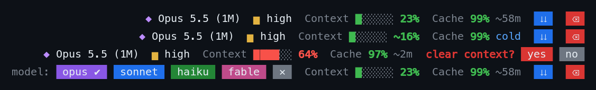

# context-bar

A footer for Claude Code. In the slot right of the hint line under the prompt, it shows:



- **Cache**: how much of the last prompt the cache served, and roughly how long until it expires: `99% ~58m`, then `cold` once it has lapsed or after a compaction.
  - Whether your account caches for 5 minutes or an hour is worked out from the requests themselves, and remembered between sessions.
  - When another mod renews the cache in the background (keep warm in warm-compact, or any mod that does the same), the countdown starts over too. The bar sees the renewal itself, so it does not need that mod installed. If the account keeps those renewals for only 5 minutes, the bar works that out the first time the cache turns out to be gone, and counts down 5 minutes after each renewal from then on.
- **Model and effort**: `◆ Opus 5.5 (1M)  ▆ high`, colored by model family and by effort level. Click either one to get a row of chips and pick another. This runs `/model` or `/effort` for you.
- **Context**: how full the context window is, in a bar that is green under 30%, orange under 60% and red after that. It moves after every response, including each step of a long turn with many tool calls, rather than waiting for the turn to end.
  - When a step adds a lot, such as a large file read, the bar rises as soon as the next request goes out, marked with `~`, and the response then replaces it with the measured figure. That early figure is the last measured one plus what Claude Code's local count says was added since. It only shows when it raises the percentage, so small steps don't make the `~` blink.
  - After a compaction or a `/clear`, and in a fresh session, Claude Code has no measured figure until the next response. Meanwhile the bar shows Claude Code's own local estimate (the one `/context` makes), marked with `~`.
- **Compact `⇊` and clear `⌫`**: one click asks first (`clear context? yes no`). The question goes away by itself after five seconds, so a stray click does nothing.
- **Subagents**: open a subagent's transcript from the tasks list and the footer switches to that agent: `↳ Explore  ◆ Haiku 4.5  Context ██░░░░ 15%`. It shows the model and effort the agent's last request used, and how full its own context window is. These are for reading only: the model and effort can't be clicked, and the cache, compact and clear are hidden, since they belong to the main conversation. Go back to the main conversation and the footer goes back too.
  - The agent's context fills in after its first response. When the agent runs on the session's model, the bar uses the session's window size. On any other model it assumes 200K, or 1M for a `[1m]` model.

On a narrow terminal the labels shorten, and when one row can't hold everything the blocks stack.

What other mods put in the same slot, such as [warm-compact](../warm-compact/)'s on/off chip, goes at the right end of the row, along with the engine's own mode labels.

## Install

```sh
claude plugin marketplace add ziedgithub/claude-code-mods && claude plugin install context-bar@zied-mods
```

Then restart Claude Code.

See the [repository README](../README.md) for running it from a clone.
