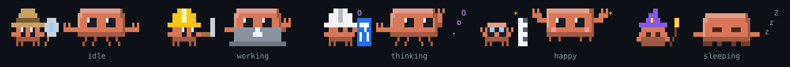
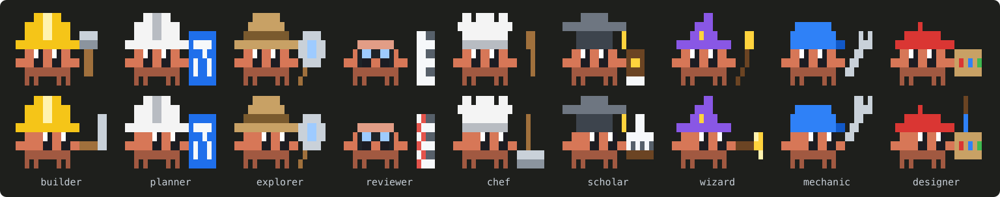

# crab-buddy

A pixel-art Claude crab lives in the band above the prompt and goes through your session with you. Each subagent gets a small crab of its own, dressed for its kind of work.


## Moods



| Mood | When | What it does |
| --- | --- | --- |
| idle | between turns | blinks, glances left and right |
| working | while Claude works | types on a laptop with its logo glowing |
| thinking | while thinking streams | raises a claw beside a growing thought bubble |
| happy | for 5 seconds after an answer | jumps with its claws up, sparks flying |
| sleeping | after a minute with nothing to do | slumps, eyes shut, `z`s rising |

## Subagents

Every subagent gets a small crab, left of the big one, that lives through the same moods for its own agent:

- It works and thinks while its agent runs.
- It cheers once the agent is done, then leaves.
- It nods off after a minute of waiting.

Up to eight are drawn, and any more are counted as `+N`.

When a subagent messages the main conversation, or sends back its final report, a small envelope flies in an arc from its crab to the big one. Its flap takes the color of the sender's costume.

### Costumes

Each small crab is dressed for its kind of work, so you can tell at a glance what each subagent is doing. It wears its hat all the time, holds its tool at its side, and uses that tool while its agent works.



| Costume | Worn by | At work |
| --- | --- | --- |
| builder: yellow hard hat | implementers, developers, engineers, fixers | hammers |
| planner: white hard hat | `Plan`, planners, architects, strategists | draws a blueprint |
| explorer: explorer's helmet | `Explore`, researchers, searchers, analysts | sweeps a magnifying glass |
| reviewer: glasses | reviewers, auditors, testers, checkers | ticks a sheet in red |
| chef: chef's hat | `general-purpose` | stirs a pot |
| scholar: mortarboard | `claude-code-guide`, writers, guides | reads a book |
| wizard: wizard's hat | `claude` | waves a wand |
| mechanic: blue cap | `statusline-setup`, setup, config, deploy | turns a wrench |
| designer: beret | designers, UI, Figma | paints from a palette |

The built-in agent types always wear the costume shown above. Any other type, such as one of your own agents or a plugin's, is dressed by the words of its name. The last word that names a kind of work wins, so `spec-reviewer` reviews and `repo-research-analyst` explores.

A type whose name says nothing about its work goes bare, in a color of its own from a spare palette. That color is remembered across sessions, so the type keeps it. A fork, a copy of the conversation, goes bare in the crab's own orange and types on a laptop like the big crab.

### In a subagent's transcript

When you open a subagent's transcript, from the list under the prompt or from `/tasks`, the band shows only that agent's crab, at the main crab's size and detail. Its costume is drawn again at that size: its hat sits on its head, and its tool is at its side. It keeps working, thinking and sleeping with its agent, and it stays dressed after the agent is done. A fork, or a type no costume fits, is the main crab itself in its own color, typing on its laptop.

The hat takes two rows over the crab. If the band doesn't have them to spare, the agent's small crab is drawn instead. Back in the main conversation, the band shows the main crab and its crew again.

## On a phone

When the terminal is narrower than about 85 columns, as on a phone:

- The crab shrinks from 16 columns to 12, and shows its glyphs over its head instead of beside it.
- Only as many small crabs as fit are drawn, and the others are counted as `+N`.

The crab sits flush against the right edge, next to the `[-]` that collapses the band.

The crab draws in the terminal only, at the finest detail a terminal's text allows. Each cell holds four pixels, two across and two down, drawn with the quarter-block characters (`▘▝▖▗▚▞▙▛▜▟`). Most terminals draw these, including the ones built on xterm.js.

## Install

```sh
claude plugin marketplace add ziedgithub/claude-code-mods && claude plugin install crab-buddy@zied-mods
```

Then restart Claude Code.

See the [repository README](../README.md) for running it from a clone.
